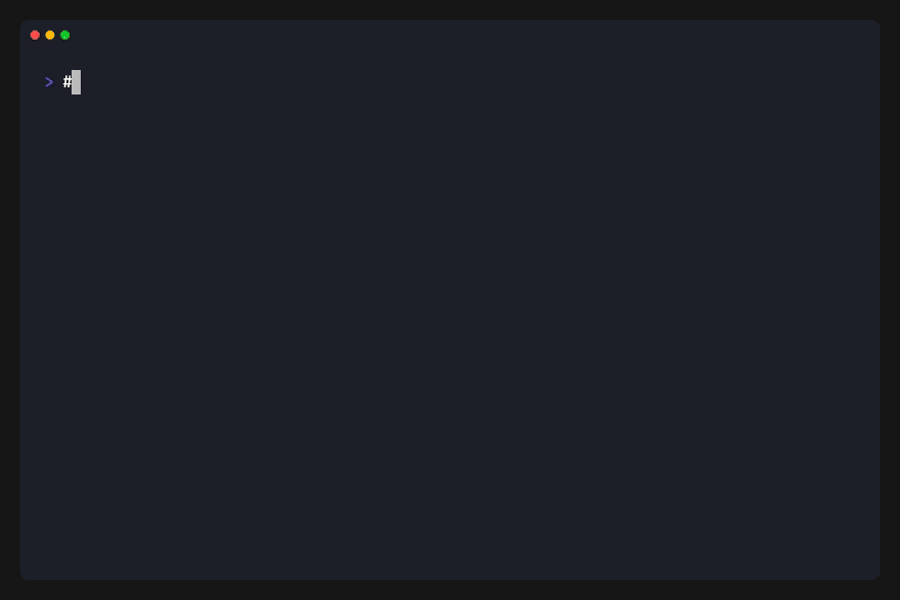

# escapepod

🚧 **escapepod is under active development.** Caveat emptor. 🚧

A Rust library and CLI for reading and writing Oxford Nanopore POD5 files.

[](https://www.rust-lang.org/)
[](LICENSE)



## Highlights

- **Fast** - Up to 9x faster than Python pod5 tools on large-file operations
- **Memory efficient** - Memory-mapped I/O for large files
- **Full featured** - View, inspect, merge, filter, subset
- **BAM integration** - Filter reads by alignment status

Experimental features — `repack`, `resquiggle`, `index`, and barcode
demultiplexing (`demux`) — live behind Cargo feature flags. See the
[docs](https://rnabioco.github.io/escapepod-rs/experimental/) for status
and build instructions.

GPU-accelerated DTW for demux classify is available via `--features gpu`
(opt-in, experimental). Uses NVRTC to compile a CUDA kernel at runtime —
no `nvcc` needed at build time, only the CUDA driver + libnvrtc at run.

## Performance

Numbers are for the I/O-bound operations where runtime is large enough to
matter; sub-second commands (`inspect`, `view`) are omitted. Measured with
`benchmarks/benchmark.sh` (hyperfine, 3 runs) versus the official Python `pod5`
(v0.3.36) on ~500k RNA004 reads (two ~250k-read files).

| Command | escapepod | pod5 | Speedup |
|---------|-----------|------|---------|
| filter | 361 ms | 3.4 s | **9.3x** |
| subset | 1.4 s | 5.1 s | **3.6x** |
| merge | 2.0 s | 6.7 s | **3.3x** |

## Install

Default build (stable commands only):

```bash
cargo install --git https://github.com/rnabioco/escapepod-rs
```

Opt into experimental commands:

```bash
# repack, resquiggle, index
cargo install --git https://github.com/rnabioco/escapepod-rs --features experimental

# barcode demultiplexing
cargo install --git https://github.com/rnabioco/escapepod-rs --features demux
```

## License

MIT, except the `resquiggle` module
(`crates/escapepod-signal/src/resquiggle/`), which is GPL-3.0-or-later.
Per-file SPDX identifiers are authoritative.

## Acknowledgments

escapepod-rs stands on the shoulders of giants. The format, algorithms,
and prior tools that made this project possible:

### POD5 format and Oxford Nanopore tooling

- **[POD5 file format](https://github.com/nanoporetech/pod5-file-format)** —
  Oxford Nanopore Technologies. escapepod-rs is a pure-Rust reader/writer
  for the POD5 specification. The official C++/Python reference is licensed
  under MPL-2.0; we do not redistribute any of its code.
- **[Tombo](https://github.com/nanoporetech/tombo)** — Oxford Nanopore
  Technologies. The t-test changepoint segmentation in
  `escapepod-signal::segmentation::ttest` is based on the Tombo algorithm.
- **[dorado](https://github.com/nanoporetech/dorado)** and
  **[remora](https://github.com/nanoporetech/remora)** — used as references
  for signal handling conventions.

### Barcode demultiplexing — KleistLab (van der Toorn / von Kleist labs)

The `escpod demux` workflow is a pure-Rust reimplementation of algorithms
from the [KleistLab](https://github.com/KleistLab):

- **[WarpDemuX](https://github.com/KleistLab/WarpDemuX)** — DTW+SVM barcode
  classifier. We reimplement the model JSON loader, DTW distance, RBF
  kernel, OvO dual coefficients, Platt scaling, and probability coupling
  to be byte-for-byte compatible with exported WarpDemuX models.
- **[ADAPTed](https://github.com/KleistLab/ADAPTed)** (Adapter and poly(A)
  Detection And Profiling Tool) by Wiep K. van der Toorn et al. The LLR
  boundary detector in `escapepod-signal::segmentation::llr` is adapted
  from ADAPTed, and `escapepod-demux::adapter_cnn` is a runtime port of
  ADAPTed's `BoundariesCNN` through `tract-onnx`.

  **Note on CNN weights:** ADAPTed's trained CNN weights are licensed
  under **CC BY-NC 4.0** and are **not bundled** with escapepod-rs. The
  `cnn-detect` feature ships only the inference code; users must export
  their own ONNX file from a local ADAPTed install (see
  `scripts/export_adapter_cnn_to_onnx.py`) and accept ADAPTed's license
  terms separately.

### Signal-to-base resquiggle

- **[fishnet](https://www.researchsquare.com/article/rs-8345719/v1)** by
  Brickner et al. The banded DP refinement and signal rescaling in
  `escapepod-signal::resquiggle` is inspired by fishnet.
- **[Remora](https://github.com/nanoporetech/remora)** — Oxford Nanopore
  Technologies. Referenced for signal-to-sequence anchoring conventions.
- **[nanopolish](https://github.com/jts/nanopolish)** by Jared Simpson
  et al. Referenced for its event-alignment approach to signal-to-base
  assignment.

### Signal compression

- **[StreamVByte](https://github.com/lemire/streamvbyte)** by Daniel
  Lemire. The SVB16 variant used by POD5's VBZ codec is derived from
  StreamVByte's design; our Rust scalar + SSSE3/AVX2 implementations are
  clean-room.
- **[zstd](https://github.com/facebook/zstd)** — the second stage of the
  VBZ pipeline.

### Citation

If you use escapepod-rs in research, please also cite the upstream tools
whose algorithms it implements (WarpDemuX, ADAPTed, fishnet, POD5).

If we've missed an acknowledgment, please open an issue.
