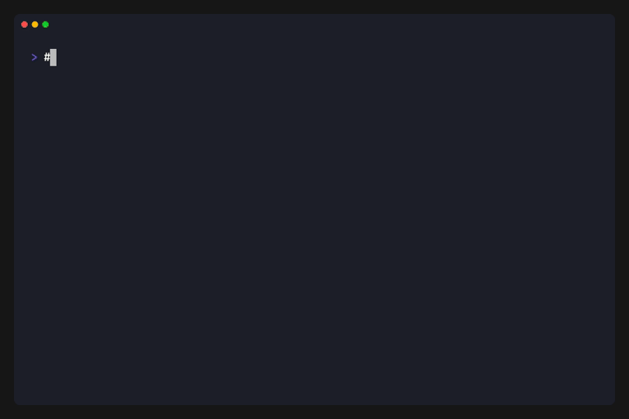

# escapepod

> [!WARNING]
> **escapepod is alpha quality and under active development.** APIs, CLI flags,
> and output formats may change without notice, and bugs are expected. Verify
> results against the official ONT `pod5` tools before relying on it for
> anything important.

A Rust library and CLI for reading and writing Oxford Nanopore POD5 files.

[](https://pypi.org/project/escapepod/)
[](https://www.rust-lang.org/)
[](LICENSE)



## Highlights

- **Fast** - 3-5x faster than the Python `pod5` tools moving bulk data, 20-50x
  on metadata-only commands
- **Memory efficient** - Memory-mapped I/O for large files
- **Full featured** - View, inspect, merge, filter, subset, index
- **BAM integration** - Filter reads by alignment status
- **Barcode demultiplexing** - `escpod demux` runs DTW-SVM, GBM, or CTC-CRF
  classification end to end, in the default build
- **Read-level models** - `escpod signal classify` scores reads against a model
  bundle from POD5 + aligned BAM (tRNA charging today), writing calls onto the
  BAM
- **`.p5s` sidecar** - Barcode assignments, experimental designs, and a read
  index live in a small Arrow file *beside* the POD5 — raw sequencer output is
  never modified, and per-barcode subsets are materialized on demand instead
  of stored
- **Crash-safe writes** - Output is staged and renamed into place, so an
  interrupted run never leaves a corrupt archive or damages an existing one

Three commands — `repack`, `resquiggle`, `annotate` — are experimental and live
behind the `experimental` Cargo feature; GPU acceleration is a single opt-in
flag (`--features gpu`), with `--device` choosing per stage at run time. See
the [docs](https://rnabioco.github.io/escapepod-rs/) for the details behind the
highlights above.

## Performance

Measured with hyperfine against the official Python `pod5` (v0.3.44) on
1.06 GB / 122,061 RNA004 reads, one full socket (48 logical cores), input on a
network filesystem and output to node-local disk.

| Command | escapepod | pod5 | Speedup |
|---------|-----------|------|---------|
| filter (copy all reads) | 1.76 s | 4.99 s | **2.8x** |
| filter (10% of reads) | 800 ms | 3.76 s | **4.7x** |
| subset (2 groups) | 1.34 s | 4.87 s | **3.6x** |
| inspect summary | 36 ms | 1.91 s | **53x** |
| view (→ /dev/null) | 226 ms | 4.95 s | **22x** |

The metadata ratios are large but the absolute differences are seconds; the
bulk-data rows are the ones that matter on a real workflow. Both tools spend
most of a bulk run reading the same input, so the ratio narrows as the input
grows relative to the output — see [`benchmarks/README.md`](benchmarks/README.md)
for that caveat, the full history, and how to reproduce.

## Install

### CLI (`escpod`)

The `escpod` binary lives in the `escapepod-cli` crate. Every tagged version
publishes prebuilt binaries on the
[releases page](https://github.com/rnabioco/escapepod-rs/releases):

| Artifact | For |
|----------|-----|
| `escpod-<ver>-{x86_64,aarch64}-unknown-linux-musl.tar.gz` | Linux, static — the portable default |
| `escpod-<ver>-x86_64-unknown-linux-gnu-gpu.tar.gz` | Linux + NVIDIA, built `--features gpu` (glibc ≥ 2.28) |
| `escpod-<ver>-{x86_64,aarch64}-apple-darwin.tar.gz` | macOS |

```bash
VER=v0.16.1
curl -L "https://github.com/rnabioco/escapepod-rs/releases/download/$VER/escpod-$VER-x86_64-unknown-linux-musl.tar.gz" | tar xz
./escpod --version
```

Take the **musl** build unless you need a GPU: it is static, so it runs on
any Linux with no library requirements at all. The GPU paths can't be — they
`dlopen` the CUDA driver and `libonnxruntime` at run time — so they ship only
in the `-gnu-gpu` artifact, whose extra run-time requirements (CUDA 12,
cuDNN 9, an onnxruntime pinned to the `ort` crate) are listed in the release
notes and under
[GPU acceleration](https://rnabioco.github.io/escapepod-rs/cli/demux/#gpu-acceleration).
On a CPU-only box that binary needs none of them — `--device auto` (the
default) just falls back.

To build instead — the default build ships the stable commands plus the full
demux tree, `signal classify`, and `index`:

```bash
cargo install --git https://github.com/rnabioco/escapepod-rs escapepod-cli
```

Opt into experimental commands:

```bash
# repack, resquiggle, annotate
cargo install --git https://github.com/rnabioco/escapepod-rs escapepod-cli --features experimental
```

### Python library

The `escapepod` Python package — a `pod5`-compatible API — is published on PyPI:

```bash
uv pip install escapepod
```

Prebuilt wheels cover CPython 3.9+ (abi3) on Linux (x86_64/aarch64, manylinux +
musllinux) and macOS (x86_64/arm64). See the [Python API docs](docs/python/index.md)
for usage and building from source.

## License

MIT.

## Acknowledgments

escapepod-rs stands on the shoulders of giants. The format, algorithms,
and prior tools that made this project possible:

### POD5 format and Oxford Nanopore tooling

- **[POD5 file format](https://github.com/nanoporetech/pod5-file-format)** —
  Oxford Nanopore Technologies. escapepod-rs is a pure-Rust reader/writer
  for the POD5 specification. The official C++/Python reference is licensed
  under MPL-2.0; we do not redistribute any of its code.
- **[Tombo](https://github.com/nanoporetech/tombo)** — Oxford Nanopore
  Technologies. The t-test changepoint segmentation in
  `escapepod-signal::segmentation::ttest` is based on the Tombo algorithm.
- **[dorado](https://github.com/nanoporetech/dorado)** and
  **[remora](https://github.com/nanoporetech/remora)** — used as references
  for signal handling conventions.

### Barcode demultiplexing — KleistLab (van der Toorn / von Kleist labs)

The `escpod demux` workflow is a pure-Rust reimplementation of algorithms
from the [KleistLab](https://github.com/KleistLab):

- **[WarpDemuX](https://github.com/KleistLab/WarpDemuX)** — DTW+SVM barcode
  classifier. We reimplement the model JSON loader, DTW distance, RBF
  kernel, OvO dual coefficients, Platt scaling, and probability coupling
  to be byte-for-byte compatible with exported WarpDemuX models.
- **[ADAPTed](https://github.com/KleistLab/ADAPTed)** (Adapter and poly(A)
  Detection And Profiling Tool) by Wiep K. van der Toorn et al. The LLR
  boundary detector in `escapepod-signal::segmentation::llr` is adapted
  from ADAPTed, and `escapepod-demux::adapter_cnn` is a runtime port of
  ADAPTed's `BoundariesCNN` through `tract-onnx`.

  **Note on CNN weights:** the `cnn-detect` code is in the default build,
  but **no weights are bundled** — the detector is architecture-agnostic
  and takes any ONNX graph on the `[B,1,L] -> [B,2,L]` contract at
  runtime. escapepod-rs points users at
  [escapepod-models](https://github.com/rnabioco/escapepod-models)'
  `adapter_rna004` TCN (CC BY 4.0). ADAPTed's own trained weights are
  licensed **CC BY-NC 4.0**; users who prefer those must export their own
  ONNX file from a local ADAPTed install (see
  `scripts/export_adapter_cnn_to_onnx.py`) and accept ADAPTed's license
  terms separately.

### Signal-to-base resquiggle

- **[fishnet](https://www.researchsquare.com/article/rs-8345719/v1)** by
  Brickner et al. The banded DP refinement and signal rescaling in
  `escapepod-signal::resquiggle` is inspired by fishnet.
- **[Remora](https://github.com/nanoporetech/remora)** — Oxford Nanopore
  Technologies. Referenced for signal-to-sequence anchoring conventions.
- **[nanopolish](https://github.com/jts/nanopolish)** by Jared Simpson
  et al. Referenced for its event-alignment approach to signal-to-base
  assignment.

### Signal compression

- **[StreamVByte](https://github.com/lemire/streamvbyte)** by Daniel
  Lemire. The SVB16 variant used by POD5's VBZ codec is derived from
  StreamVByte's design; our Rust scalar + SSSE3/AVX2 implementations are
  clean-room.
- **[zstd](https://github.com/facebook/zstd)** — the second stage of the
  VBZ pipeline.

### Citation

If you use escapepod-rs in research, please also cite the upstream tools
whose algorithms it implements (WarpDemuX, ADAPTed, fishnet, POD5).

If we've missed an acknowledgment, please open an issue.
