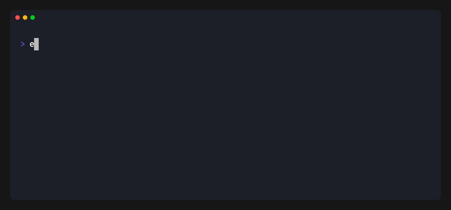

# podfive filter

Extract specific reads from a POD5 file based on read IDs.



## Usage

```bash
podfive filter -i <IDS_FILE> -o <OUTPUT> <INPUT>
```

## Arguments

| Argument | Description |
|----------|-------------|
| `<INPUT>` | Input POD5 file to filter |

## Options

| Option | Description |
|--------|-------------|
| `-i, --ids <FILE>` | File containing read IDs to extract (required) |
| `-o, --output <FILE>` | Output file path (required) |
| `-h, --help` | Print help |

## ID File Format

The IDs file should contain one UUID per line:

```
a1b2c3d4-e5f6-7890-abcd-ef1234567890
b2c3d4e5-f6a7-8901-bcde-f12345678901
c3d4e5f6-a7b8-9012-cdef-123456789012
```

### Supported Formats

- Standard UUID: `a1b2c3d4-e5f6-7890-abcd-ef1234567890`
- No dashes: `a1b2c3d4e5f67890abcdef1234567890`
- Comments (lines starting with `#`) are ignored
- Empty lines are ignored

## Examples

### Basic Filtering

Create a file with read IDs:

```bash
cat > interesting_reads.txt << EOF
a1b2c3d4-e5f6-7890-abcd-ef1234567890
b2c3d4e5-f6a7-8901-bcde-f12345678901
EOF
```

Filter the POD5 file:

```bash
podfive filter -i interesting_reads.txt -o filtered.pod5 experiment.pod5
```

### Filter from Basecalling Results

If you have basecalling results with read IDs of interest:

```bash
# Extract read IDs from a BAM file (requires samtools)
samtools view aligned.bam | cut -f1 | sort -u > mapped_reads.txt

# Filter POD5 to only mapped reads
podfive filter -i mapped_reads.txt -o mapped.pod5 experiment.pod5
```

### Filter Using Another POD5 File

Extract reads that exist in another file:

```bash
podfive inspect reads reference.pod5 > reference_ids.txt
podfive filter -i reference_ids.txt -o matching.pod5 experiment.pod5
```

## Output

The command prints filtering statistics:

```
Filtering experiment.pod5 using IDs from interesting_reads.txt
Output: filtered.pod5
Loaded 100 read IDs to filter
Filtered 95 reads from 10000 total (0.95%)
Warning: 5 requested IDs were not found in the input file
```

## Notes

- Only reads with matching IDs are included in output
- Run info is preserved for all matching reads
- Signal data is re-compressed in the output
- A warning is shown if some requested IDs are not found
