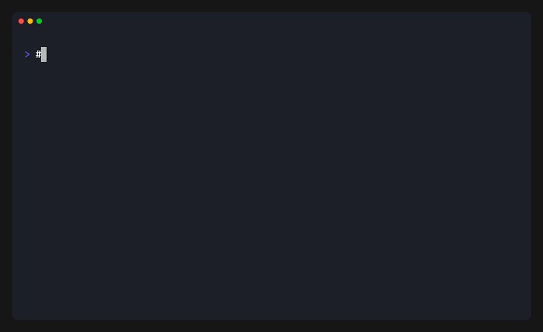

# podfive subset

Split reads from a POD5 file into multiple output files based on a CSV mapping.



## Usage

```bash
podfive subset --csv <FILE> -o <OUTPUT_DIR> [OPTIONS] <INPUT>
```

## Arguments

| Argument | Description |
|----------|-------------|
| `<INPUT>` | Input POD5 file |

## Options

| Option | Description |
|--------|-------------|
| `--csv <FILE>` | CSV file with read_id,output columns (required) |
| `-o, --output-dir <DIR>` | Output directory (default: current directory) |
| `-f, --force` | Overwrite existing files |
| `-h, --help` | Print help |

## CSV File Format

The CSV file must have a header row with `read_id` and `output` columns:

```csv
read_id,output
a1b2c3d4-e5f6-7890-abcd-ef1234567890,sample1.pod5
b2c3d4e5-f6a7-8901-bcde-f12345678901,sample1.pod5
c3d4e5f6-a7b8-9012-cdef-123456789012,sample2.pod5
```

### Supported UUID Formats

- Standard format: `a1b2c3d4-e5f6-7890-abcd-ef1234567890`
- No dashes: `a1b2c3d4e5f67890abcdef1234567890`
- Uppercase: `A1B2C3D4-E5F6-7890-ABCD-EF1234567890`

### Notes

- Whitespace is trimmed from fields
- Empty lines are ignored
- Each unique `output` value creates a separate POD5 file

## Examples

### Basic Subsetting

Create a mapping file:

```bash
cat > mapping.csv << EOF
read_id,output
a1b2c3d4-e5f6-7890-abcd-ef1234567890,barcode01.pod5
b2c3d4e5-f6a7-8901-bcde-f12345678901,barcode01.pod5
c3d4e5f6-a7b8-9012-cdef-123456789012,barcode02.pod5
EOF
```

Split the POD5 file:

```bash
podfive subset experiment.pod5 --csv mapping.csv -o demultiplexed/
```

### Demultiplexing by Barcode

If you have demultiplexing results from basecalling:

```bash
# Assuming you have a CSV from your demultiplexing pipeline
podfive subset multiplexed.pod5 --csv barcode_assignments.csv -o demux/
```

### Splitting by Sample

Split reads into per-sample files:

```bash
podfive subset pooled.pod5 --csv sample_mapping.csv -o samples/
```

## Output

The command prints a summary of the subsetting operation:

```
Subsetting 10000 reads into 3 output file(s)
Subsetting [████████████████████████████████████████] 10000/10000

Subset summary:
  Matched reads: 9500
  Unmatched reads: 500

Output files:
  demux/barcode01.pod5 (4000 reads)
  demux/barcode02.pod5 (3500 reads)
  demux/barcode03.pod5 (2000 reads)
```

## Notes

- Reads not in the CSV mapping are excluded from output
- Run info is copied to all output files
- Each output file is a complete, valid POD5 file
- Signal data is decompressed and re-compressed for each output
