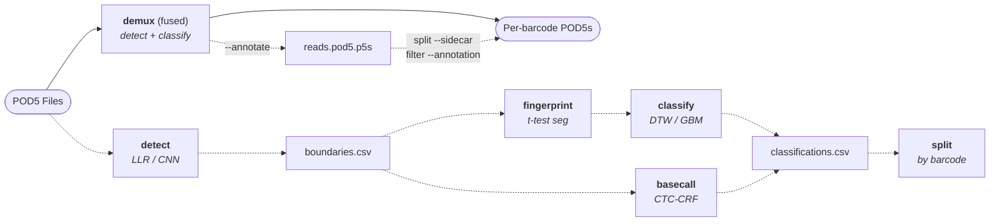

# escpod demux

Barcode demultiplexing for Oxford Nanopore sequencing data, in the default
`escpod` build — including CNN/TCN adapter detection (`--method cnn`, what
the published [escapepod-models](https://github.com/rnabioco/escapepod-models)
barcodes were trained against) and CTC-CRF basecalling. Reads are classified
from the raw signal and either split into per-barcode POD5 files or recorded
in the [`.p5s` sidecar](../format/sidecar.md) so nothing needs splitting at
all.

GPU acceleration and model training are opt-in builds — see
[GPU acceleration](#gpu-acceleration) below. In a GPU-capable build the device
is used automatically where it wins; `--device` overrides that.

## Fused pipeline (recommended)

Running `escpod demux` with no subcommand streams the whole pipeline —
adapter detection, classification, and output — in one pass over the input:

```bash
# Fetch a model bundle once (networked node; compute nodes can't reach GitHub)
escpod demux models fetch crf_nbc16_rna004

# Demux into per-barcode POD5 files
escpod demux reads.pod5 --model ~/.cache/escapepod/demux_models/barcode_crf_nbc16_rna004@v0.3.1 -d out/

# Or demux into the sidecar only — no split files, no CSV
escpod demux reads.pod5 --model <bundle> --annotate
```

Key options (see `escpod demux --help` for the full set):

| Option | Description |
|--------|-------------|
| `--model <PATH>` | Model: DTW-SVM / GBM JSON, or a CTC-CRF bundle directory |
| `-d, --output-dir <DIR>` | Write per-barcode POD5 files (optional with `--annotate`) |
| `--annotate` | Record assignments in each input's `.p5s` sidecar |
| `--classifications <FILE>` | Also write a `read_id,barcode,confidence` CSV |
| `--prefix <STR>` | Split-file prefix (default: `barcode`) |
| `--method <cnn\|llr>` | Adapter detector (CRF bundles pin their own) |
| `--device <auto\|cpu\|gpu>` | Where GPU-capable stages run (default `auto`) — see [GPU acceleration](#gpu-acceleration) |
| `--info` | Describe the model and exit |

### Sidecar output

`--annotate` composes with the other outputs: alone it is *sidecar-only*
demux (the POD5 is never duplicated), with `-d` it writes split files *and*
the sidecar, and `--classifications` can keep the CSV too. Materialize
subsets later, on demand:

```bash
escpod demux split reads.pod5 --sidecar -d out/                    # all barcodes
escpod filter reads.pod5 --annotation barcode=nbc05 -o nbc05.pod5  # one group
```

The stepwise subcommands below remain available for running stages
individually or inspecting intermediates.

## Comparison with WarpDemuX

Escapepod demux is a pure Rust reimplementation of the signal-level barcode demultiplexing algorithms from [WarpDemuX](https://github.com/KleistLab/WarpDemuX) and [ADAPTed](https://github.com/KleistLab/ADAPTed). The key differences are:

| Feature | Escapepod | WarpDemuX/ADAPTed |
|---------|-----------|-------------------|
| Language | Pure Rust | Python + C |
| Dependencies | None (statically linked) | PyTorch, dtaidistance, pod5 |
| Adapter detection | LLR + CNN | LLR + CNN + fallback |
| Classification | DTW (Rust) | DTW (dtaidistance) |
| Model format | JSON (native or WarpDemuX) | Scikit-learn pickle |

### Performance Benchmarks

Early numbers (LLR + DTW path, before the CNN/CRF heads landed) on RNA004
data with 5 barcodes (1000 reads total), 4 threads:

| Metric | Escapepod | WarpDemuX |
|--------|-----------|-----------|
| **Detection speed** | 14x faster | baseline |
| **Full pipeline** | ~0.5s | ~2.4s |
| **Throughput** | ~2000 reads/sec | ~400 reads/sec |

**Note:** For best classification accuracy, use a published model bundle
(`escpod demux models list` / `fetch`) or a WarpDemuX-exported model via
`--model`. The escpod training workflow is experimental and may not
generalize well to new samples.

## Overview

The demux workflow analyzes the raw nanopore signal to detect adapter regions, extract barcode fingerprints, classify reads, and optionally split them into separate files.



## Subcommands

| Subcommand | Description |
|------------|-------------|
| [detect](#detect) | Detect adapter boundaries (LLR or CNN) |
| [fingerprint](#fingerprint) | Extract signal fingerprints from adapter regions |
| [classify](#classify) | Classify reads by barcode using DTW distance |
| `basecall` | CTC-CRF barcode basecalling from a boundaries CSV; `--barcodes` assigns reads by edit distance |
| [split](#split) | Split reads into separate POD5 files by barcode (CSV or `--sidecar`) |
| `models` | List / fetch published model bundles (`list`, `path`, `fetch`) |
| [train](#train) | Train reference fingerprints from known samples |
| [train-svm](#train-svm) | Train SVM model from fingerprints (requires `train` feature) |

---

## detect

Detect adapter boundaries in reads using the Log-Likelihood Ratio (LLR) algorithm. This identifies where the adapter sequence starts and ends in the raw signal.

### Signal Structure (RNA Sequencing)

```
Signal Level
     │
high │  ╭──────╮                              ╭────────────
     │  │      │                              │
     │  │      ╰──────────────────────────────╯
     │  │  Open   Adapter      Barcode      RNA
low  │──╯  Pore   (detected    region       transcript
     └────────────────────────────────────────────────────▶
                                                        Time
              │◀─── Adapter Region ───▶│
          adapter_start            adapter_end
```

### LLR Algorithm

The LLR algorithm finds boundaries by maximizing the variance difference between adjacent segments:

```
                    LLR Boundary Detection
                    ─────────────────────

Signal:  ▁▁▁▁▁▁▁█████████▁▁▁▁▁▁▁▁▁▁▁▁▁▁▁▁
                ▲       ▲
                │       │
              Split   Split
              Point   Point

For each candidate position i:

  gain(i) = n × log(var[0,n)) - [n_head × log(var[0,i)) + n_tail × log(var[i,n))]
                ▲                      ▲                        ▲
                │                      │                        │
         Full variance          Head variance           Tail variance

The position with maximum gain indicates the best split point.
```

### Usage

```bash
escpod demux detect <FILES>... -o <OUTPUT>
```

### Arguments

| Argument | Description |
|----------|-------------|
| `<FILES>` | Input POD5 file(s) |

### Options

| Option | Description |
|--------|-------------|
| `-o, --output <FILE>` | Output boundaries CSV file (required) |
| `--min-adapter <N>` | Minimum adapter observations (default: 200) |
| `--border-trim <N>` | Border trim size (default: 50) |
| `--downscale <N>` | Downscale factor for signal processing (default: 10, WarpDemuX-native; set 1 for full resolution) |
| `--method <cnn\|llr>` | Boundary detector; `cnn` is what the published models were trained against |
| `--cnn-model <FILE>` / `--cnn-model-name <NAME>` | Boundary-CNN ONNX (explicit path, or a fetched bundle by name) |
| `--device <auto\|cpu\|gpu>` | Where CNN detection runs (default `auto`, which prefers the GPU here) |
| `-t, -j, --threads <N>` | Number of threads for parallel processing (default: 16, capped at available CPUs) |
| `-h, --help` | Print help |

### Output Format

The output CSV contains:

```csv
read_id,num_samples,adapter_start,adapter_end
a1b2c3d4-...,50000,1500,4200
b2c3d4e5-...,48000,1200,3800
```

| Column | Description |
|--------|-------------|
| `read_id` | Read UUID |
| `num_samples` | Total signal samples |
| `adapter_start` | Adapter start position (samples) |
| `adapter_end` | Adapter end position (samples) |

### Example

```bash
escpod demux detect *.pod5 -o boundaries.csv --min-adapter 200 -j 8
```

---

## fingerprint

Extract barcode fingerprints from adapter regions using t-test segmentation. The fingerprint is a fixed-length feature vector representing the barcode signal pattern.

### Fingerprint Extraction Pipeline

```
┌─────────────────────────────────────────────────────────────────────────────┐
│                     FINGERPRINT EXTRACTION                                   │
└─────────────────────────────────────────────────────────────────────────────┘

Raw Signal (adapter region only)
    │
    ▼
┌─────────────┐
│ Normalize   │  MAD normalization: (x - median) / MAD
│ (MAD)       │
└─────────────┘
    │
    ▼
┌─────────────┐
│ T-test      │  Find N-1 changepoints using sliding window t-test
│ Segment     │
└─────────────┘
    │
    ▼
┌─────────────┐
│ Compute     │  Mean signal level per segment
│ Means       │
└─────────────┘
    │
    ▼
┌─────────────┐
│ Normalize   │  Z-score, min-max, median, or none
│ Features    │
└─────────────┘
    │
    ▼
Fingerprint Vector [fp_0, fp_1, ..., fp_n]
```

### T-test Segmentation

The algorithm uses a sliding window t-test to find changepoints:

```
Window-Based Changepoint Detection
──────────────────────────────────

Signal: ████████▄▄▄▄▄▄▄▄▄▄▄▄▄▄▄▄▄▄▄▄▄▄████████████████
              ◀──W──▶◀──W──▶
              Window1 Window2

At each position, compare adjacent windows:

  t_score = |mean₁ - mean₂| / √(var₁ + var₂)

        t-score
          ▲
          │        *
          │       * *
          │      *   *
          │  ···*     *···
          │ *           *
          └─────────────────▶ position
                   ▲
                   │
              Changepoint
              (local max)

Select top N changepoints with minimum separation.
```

### Resulting Segments

```
Segmented Signal with Means
───────────────────────────

Signal: ─────────────────────────────────────────────────
        ▁▁▁▁▁│████│▄▄▄▄▄│███│▁▁▁▁▁│▄▄▄▄│▁▁▁▁▁▁▁│████│▁▁
        seg 0│seg1│seg 2│seg3│seg 4│seg5│ seg 6 │seg7│...
        ──────────────────────────────────────────────────▶
                                                     samples

Fingerprint = [mean₀, mean₁, mean₂, mean₃, mean₄, mean₅, mean₆, mean₇, ...]
            = [-0.82,  1.23, -0.15,  0.95, -0.71,  0.12, -0.45,  1.08, ...]
```

### Usage

```bash
escpod demux fingerprint <FILES>... --boundaries <CSV> -o <OUTPUT>
```

### Arguments

| Argument | Description |
|----------|-------------|
| `<FILES>` | Input POD5 file(s) |

### Options

| Option | Description |
|--------|-------------|
| `--boundaries <FILE>` | Boundaries CSV from detect command (required) |
| `-o, --output <FILE>` | Output fingerprints CSV file (required) |
| `--segment-start <N>` | Start sample offset within adapter region (default: 1000) |
| `--segment-end <N>` | End sample offset within adapter region (default: 2000) |
| `--num-segments <N>` | Number of fingerprint segments (default: 10) |
| `--window-width <N>` | T-test window width (default: 5) |
| `--normalize <METHOD>` | Normalization method: zscore, minmax, median, none (default: zscore) |
| `-t, -j, --threads <N>` | Number of threads for parallel processing (default: 16, capped at available CPUs) |
| `-h, --help` | Print help |

**Note:** The `--segment-start` and `--segment-end` options define which region within the adapter to use for fingerprinting. The defaults (1000-2000) match the training parameters, ensuring consistency between training and classification.

### Output Format

```csv
read_id,fp_0,fp_1,fp_2,fp_3,fp_4,fp_5,fp_6,fp_7,fp_8,fp_9
a1b2c3d4-...,-0.823451,1.234567,-0.156789,0.951234,...
b2c3d4e5-...,-0.712345,0.987654,-0.234567,1.123456,...
```

### Example

```bash
escpod demux fingerprint *.pod5 --boundaries boundaries.csv -o fingerprints.csv
escpod demux fingerprint *.pod5 --boundaries boundaries.csv -o fp.csv --num-segments 12 --normalize median
```

---

## classify

Classify reads by barcode using Dynamic Time Warping (DTW) distance between fingerprints and reference barcodes.

### DTW Distance Calculation

```
┌─────────────────────────────────────────────────────────────────────────────┐
│                  DYNAMIC TIME WARPING (DTW)                                  │
└─────────────────────────────────────────────────────────────────────────────┘

Query fingerprint:     Q = [q₀, q₁, q₂, q₃, q₄, ...]
Reference fingerprint: R = [r₀, r₁, r₂, r₃, r₄, ...]

DTW finds the optimal alignment between sequences:

        r₀  r₁  r₂  r₃  r₄
       ┌───┬───┬───┬───┬───┐
   q₀  │ ● │   │   │   │   │   Legend:
       ├───┼───┼───┼───┼───┤   ● = optimal path
   q₁  │   │ ● │   │   │   │   ─ = allowed moves
       ├───┼───┼───┼───┼───┤
   q₂  │   │ ● │ ● │   │   │   D[i,j] = |qᵢ - rⱼ| + min(D[i-1,j],
       ├───┼───┼───┼───┼───┤                          D[i,j-1],
   q₃  │   │   │   │ ● │   │                          D[i-1,j-1])
       ├───┼───┼───┼───┼───┤
   q₄  │   │   │   │   │ ● │   DTW distance = D[n,m]
       └───┴───┴───┴───┴───┘

Sakoe-Chiba Band Constraint (--window):
────────────────────────────────────────
       ┌───┬───┬───┬───┬───┐
   q₀  │░░░│░░░│   │   │   │   ░ = valid region
       ├───┼───┼───┼───┼───┤       (within window)
   q₁  │░░░│░░░│░░░│   │   │
       ├───┼───┼───┼───┼───┤   Constraint: |i - j| ≤ window
   q₂  │   │░░░│░░░│░░░│   │
       ├───┼───┼───┼───┼───┤   Reduces time from O(nm) to O(n·w)
   q₃  │   │   │░░░│░░░│░░░│
       ├───┼───┼───┼───┼───┤
   q₄  │   │   │   │░░░│░░░│
       └───┴───┴───┴───┴───┘
```

### Classification Process

```
Classification Decision
───────────────────────

Query fingerprint ─┬─▶ DTW(query, barcode_01) ───▶ d₁ = 0.23
                   ├─▶ DTW(query, barcode_02) ───▶ d₂ = 0.87
                   ├─▶ DTW(query, barcode_03) ───▶ d₃ = 0.45
                   └─▶ DTW(query, barcode_04) ───▶ d₄ = 0.91

Best match:        barcode_01 (d₁ = 0.23)
Second best:       barcode_03 (d₃ = 0.45)

Confidence ratio = d_best / d_second_best = 0.23 / 0.45 = 0.51

If ratio < threshold (e.g., 0.8):
  → Assign to barcode_01 with confidence 0.51
Else:
  → Mark as "unclassified" (ambiguous)
```

### Usage

```bash
escpod demux classify <FINGERPRINTS> --reference <CSV> -o <OUTPUT>
escpod demux classify <FINGERPRINTS> --model <JSON> -o <OUTPUT>
```

### Arguments

| Argument | Description |
|----------|-------------|
| `<FINGERPRINTS>` | Input fingerprints CSV |

### Options

| Option | Description |
|--------|-------------|
| `--reference <FILE>` | Reference fingerprints CSV (from train command) |
| `--model <FILE>` | WarpDemuX model JSON file |
| `-o, --output <FILE>` | Output classifications CSV (required) |
| `--window <N>` | DTW window size (Sakoe-Chiba band, optional) |
| `--min-ratio <RATIO>` | Top-2 distance-ratio threshold below which a read is confident (default: 0.8) |
| `--model-name <NAME>` | Use a fetched model bundle by name instead of `--model` |
| `--probabilities` | Emit per-class probabilities (SVM models) |
| `--device <auto\|cpu\|gpu>` | Where DTW runs. `auto` keeps it on the **CPU** — see the warning below |
| `-t, -j, --threads <N>` | Number of threads for parallel processing (default: 16, capped at available CPUs) |
| `-h, --help` | Print help |

!!! warning "GPU DTW classify is experimental and usually slower"
    This is why `--device auto` leaves DTW on the CPU even with an idle GPU in
    the node. On a full node the CPU DTW beats the GPU: 113 s on 64 CPU cores
    vs 132 s on an A30 (0.85x), plus ~2.2 GB more RSS, on a 1.22M-read DTW-SVM
    run. An apparent 1.67x speedup vanishes once the CPU is given the whole
    node instead of 16 of 64 cores. It may still help where cores are scarce
    relative to the DTW workload, which is what `--device gpu` is for; it does
    nothing for GBM models. The GPU paths that *do* pay off are CNN adapter
    detection and the CRF encoder — see
    [GPU acceleration](#gpu-acceleration).

### Output Format

```csv
read_id,barcode,confidence,best_distance,second_best_distance
a1b2c3d4-...,barcode_01,0.512,0.234,0.457
b2c3d4e5-...,barcode_03,0.723,0.156,0.216
c3d4e5f6-...,unclassified,0.912,0.345,0.378
```

| Column | Description |
|--------|-------------|
| `read_id` | Read UUID |
| `barcode` | Assigned barcode or "unclassified" |
| `confidence` | Distance ratio (lower = more confident) |
| `best_distance` | DTW distance to best match |
| `second_best_distance` | DTW distance to second best |

### Example

```bash
# Using reference fingerprints
escpod demux classify fingerprints.csv --reference reference.csv -o classifications.csv

# Using WarpDemuX model
escpod demux classify fingerprints.csv --model warpdemux.json -o classifications.csv --window 10

# With a custom confidence ratio
escpod demux classify fingerprints.csv --reference reference.csv -o out.csv --min-ratio 0.7
```

---

## split

Split reads into separate POD5 files based on barcode classification.

### Usage

```bash
escpod demux split <FILES>... --classifications <CSV> --output-dir <DIR>
```

### Arguments

| Argument | Description |
|----------|-------------|
| `<FILES>` | Input POD5 file(s) |

### Options

| Option | Description |
|--------|-------------|
| `--classifications <FILE>` | Classifications CSV from classify/basecall (or use `--sidecar`) |
| `--sidecar` | Read assignments from each input's `.p5s` sidecar instead of a CSV |
| `--annotation <NAME>` | Sidecar annotation to split by (default: `barcode`) — e.g. a design-derived `condition` |
| `-d, --output-dir <DIR>` | Output directory for demuxed files (required) |
| `--prefix <STR>` | Output file prefix (default: `barcode`) |
| `--classified-only` | Drop unclassified reads instead of writing them to their own file |
| `-f, --force` | Overwrite existing per-barcode output files |
| `-t, -j, --threads <N>` | Number of threads for parallel processing (default: 16, capped at available CPUs) |
| `-h, --help` | Print help |

### Output Structure

```
output_dir/
├── barcode_nbc01.pod5
├── barcode_nbc02.pod5
├── barcode_nbc03.pod5
└── barcode_unclassified.pod5   (omitted with --classified-only)
```

### Example

```bash
escpod demux split *.pod5 --classifications classifications.csv -d demuxed/
escpod demux split reads.pod5 --sidecar -d demuxed/                        # from .p5s
escpod demux split reads.pod5 --sidecar --annotation condition -d by_cond/ # by design variable
```

---

## train

Train reference barcode fingerprints from known samples. Use this to create a custom reference for your barcode set.

### Training Workflow

```
Training Reference Fingerprints
───────────────────────────────

Input Option A: Directory structure
─────────────────────────────────
input_dir/
├── barcode_01/
│   ├── sample1.pod5
│   └── sample2.pod5
├── barcode_02/
│   ├── sample1.pod5
│   └── sample2.pod5
└── barcode_03/
    └── sample1.pod5

Input Option B: Assignments CSV
───────────────────────────────
read_id,barcode,pod5_file
a1b2...,barcode_01,sample1.pod5
b2c3...,barcode_01,sample1.pod5
c3d4...,barcode_02,sample2.pod5

Processing:
───────────
For each barcode:
  1. Extract fingerprints from all assigned reads
  2. Compute consensus (mean) fingerprint
  3. Compute standard deviation per feature

Output: reference.json
─────────────────────
{
  "barcodes": {
    "barcode_01": {
      "fingerprint": [0.12, -0.45, ...],
      "std_dev": [0.05, 0.08, ...],
      "read_count": 150
    },
    "barcode_02": { ... }
  },
  "metadata": {
    "num_segments": 10,
    "normalization": "zscore"
  }
}
```

### Usage

```bash
escpod demux train --input-dir <DIR> -o <OUTPUT>
escpod demux train --assignments <CSV> -o <OUTPUT>
```

### Options

| Option | Description |
|--------|-------------|
| `--input-dir <DIR>` | Directory with barcode subdirectories containing POD5 files |
| `--assignments <CSV>` | CSV with read_id, barcode, pod5_file columns |
| `-o, --output <FILE>` | Output reference JSON file (required) |
| `--segment-start <N>` | Start sample for fingerprint region (default: 1000) |
| `--segment-end <N>` | End sample for fingerprint region (default: 2000) |
| `--num-segments <N>` | Number of fingerprint segments (default: 10) |
| `--window-width <N>` | T-test window width (default: 5) |
| `--normalize <METHOD>` | Normalization method (default: zscore) |
| `--min-adapter <N>` | Minimum adapter observations (default: 200) |
| `--border-trim <N>` | Border trim size (default: 50) |
| `-t, -j, --threads <N>` | Number of threads for parallel processing (default: 16, capped at available CPUs) |
| `-h, --help` | Print help |

### Output Format

The train command outputs a JSON file with consensus fingerprints for each barcode:

```json
{
  "barcodes": {
    "BC00": {
      "fingerprint": [0.12, -0.45, ...],
      "std_dev": [0.05, 0.08, ...],
      "read_count": 150
    }
  },
  "params": { "segment_start": 1000, "segment_end": 2000, "num_segments": 10 }
}
```

**Note:** For best classification accuracy, we recommend using WarpDemuX pre-trained models instead of training your own. The escpod training workflow produces consensus fingerprints that may not generalize as well as WarpDemuX's SVM-based models.

### Example

```bash
# From directory structure
escpod demux train --input-dir training_samples/ -o reference.json

# From assignments CSV
escpod demux train --assignments known_barcodes.csv -o reference.json

# Use trained reference for classification
escpod demux classify fingerprints.csv --reference reference.json -o classifications.csv
```

---

## train-svm

Train an SVM model from labeled fingerprints for probabilistic barcode classification. This command requires the `train` feature to be enabled.

**Note:** This creates a DTW-SVM model that provides probability outputs for each class, enabling more nuanced confidence thresholds.

### Usage

```bash
escpod demux train-svm -f <FINGERPRINTS> -o <OUTPUT> [OPTIONS]
```

### Options

| Option | Description |
|--------|-------------|
| `-f, --fingerprints <FILE>` | CSV file with fingerprints (read_id, barcode, feat1, feat2, ...) (required) |
| `-o, --output <FILE>` | Output JSON file for trained SVM model (required) |
| `--gamma <VALUE>` | RBF kernel gamma parameter (default: 1.0) |
| `--power <VALUE>` | Power to raise distances before exponential (default: 1.0) |
| `--c <VALUE>` | SVM regularization parameter C (default: 1.0) |
| `--window <N>` | DTW window constraint (Sakoe-Chiba band) |
| `--thresholds <VALUES>` | Per-class confidence thresholds (comma-separated) |
| `-h, --help` | Print help |

### Input Format

The fingerprints CSV should include barcode labels:

```csv
read_id,barcode,fp_0,fp_1,fp_2,...,fp_9
a1b2c3d4-...,BC00,-0.823,1.234,-0.156,...
b2c3d4e5-...,BC00,-0.712,0.987,-0.234,...
c3d4e5f6-...,BC01,-0.456,0.789,-0.321,...
```

### Example

```bash
# Train SVM with default parameters
escpod demux train-svm -f fingerprints.csv -o model.json

# Train with custom hyperparameters
escpod demux train-svm -f fingerprints.csv -o model.json --gamma 0.5 --c 10.0 --window 10

# Use the trained SVM model for classification (--model auto-detects the JSON shape)
escpod demux classify fingerprints.csv --model model.json -o classifications.csv
```

### Building with train feature

```bash
cargo build --release --features train
```

---

## Complete Workflow Example

### Fused pipeline (recommended)

```bash
# One pass: detect + classify + output. --annotate keeps everything in the
# sidecar; add -d out/ to also write per-barcode files.
escpod demux reads.pod5 --model <bundle-or-model.json> --annotate

escpod inspect summary reads.pod5                 # barcode counts, sidecar state
escpod demux split reads.pod5 --sidecar -d out/   # materialize when needed
```

### Stepwise (inspectable intermediates)

```bash
# 1. Detect adapter boundaries in all POD5 files
escpod demux detect *.pod5 -o boundaries.csv -j 8

# 2. Extract fingerprints from adapter regions
escpod demux fingerprint *.pod5 --boundaries boundaries.csv -o fingerprints.csv

# 3. Classify reads using a pre-trained model
escpod demux classify fingerprints.csv --model warpdemux_model.json -o classifications.csv

# 4. Split into separate files (unclassified reads get their own file by default)
escpod demux split *.pod5 --classifications classifications.csv -d demuxed/

# View classification summary
cut -d, -f2 classifications.csv | sort | uniq -c | sort -rn
```

### Training Your Own Reference (Experimental)

If you have known barcode samples, you can train a consensus-based reference:

```bash
# Create assignments CSV with known read-to-barcode mappings
cat > assignments.csv << EOF
read_id,barcode,pod5_file
a1b2c3d4-...,BC00,sample1.pod5
b2c3d4e5-...,BC00,sample1.pod5
c3d4e5f6-...,BC01,sample2.pod5
EOF

# Train reference fingerprints
escpod demux train --assignments assignments.csv -o reference.json -j 8

# Use the trained reference for classification
escpod demux detect *.pod5 -o boundaries.csv -j 8
escpod demux fingerprint *.pod5 --boundaries boundaries.csv -o fingerprints.csv
escpod demux classify fingerprints.csv --reference reference.json -o classifications.csv
```

**Note:** For production use, we recommend using WarpDemuX pre-trained models which provide significantly better generalization.

### Using WarpDemuX Models

You can export WarpDemuX models using the provided script:

```bash
# Export a WarpDemuX model to JSON format
python scripts/export_warpdemux_model.py path/to/warpdemux_model.pkl -o model.json

# Use the exported model
escpod demux classify fingerprints.csv --model model.json -o classifications.csv
```

## GPU acceleration

One opt-in Cargo feature, `gpu`, enables every GPU path. At run time
`--device auto` (the default) decides per stage:

| Stage | Runs on the GPU under `auto`? | Why |
|-------|-------------------------------|-----|
| CNN adapter detection (`--method cnn`) | **Yes** | Detection is inference-bound and tract has no efficient batched conv. ~7× faster end-to-end on an A30 — the path that pays off most. |
| CTC-CRF encoder | **Yes** | The encoder is ~91% of that head's CPU cost. ~4× end-to-end. |
| DTW classification | **No** | The CPU is faster: 113 s on 64 cores vs 132 s on an A30, plus ~2.2 GB more RSS. `--device gpu` opts in anyway; worth it only when cores are scarce. |
| GBM classification | **No** | No GPU implementation — a 32-core CPU pool beats one GPU stream on the tree walk by roughly 20×. |
| LLR adapter detection | **No** | No GPU implementation; it is a CPU changepoint search. |

`--device` takes three values:

- **`auto`** (default) — the table above, and only when the relevant Cargo
  feature is compiled in *and* a CUDA device is visible. Never an error.
- **`gpu`** — a **requirement**, not a request. A missing feature, an absent
  device, or an onnxruntime that cannot register its CUDA execution provider
  each fail the run with a message naming the cause. This is deliberate: a
  best-effort CUDA registration that quietly commits to the CPU provider is how
  a broken runtime produced correct, slow, accelerated-looking runs for months.
- **`cpu`** — CPU everywhere, device or no device.

`--gpu` still works as a hidden, deprecated alias for `--device gpu` (it warns,
including about the change in meaning); `--cpu` is an alias for `--device cpu`.
Both conflict with `--device`. `--device` is accepted in **every** build,
including the release artifacts that contain no GPU code — `--device gpu` there
tells you the feature is not compiled in rather than failing on an unknown
argument.

!!! tip "A CPU run that could have been a GPU run says so"
    Whenever a GPU-capable stage lands on the CPU, escpod logs a warning at
    startup naming the cost and the cause:

    ```
    WARN boundary CNN adapter detection is running on the CPU (~7x slower than
         GPU end-to-end); no CUDA device is visible. Allocate a GPU (SLURM:
         `--gres=gpu:1`) and check `nvidia-smi`, or pass `--device cpu` to
         silence this.
    ```

    The two causes are distinguished — `this build has no cnn-gpu feature`
    needs a rebuild, `no CUDA device is visible` needs an allocation.

`gpu` is the only GPU flag, in the CLI and in `escapepod-demux` alike. There is
no way to build half a GPU binary, so there is no combination in which `--gpu`
silently does nothing for a stage that has a device path.

(`escapepod-signal` keeps its own, narrower `gpu` feature: the cudarc DTW kernel
without onnxruntime, for a consumer that wants the kernel and not the pipeline.)

### Getting a GPU-capable binary

Each release ships one, `escpod-<ver>-x86_64-unknown-linux-gnu-gpu.tar.gz`
on the [releases page](https://github.com/rnabioco/escapepod-rs/releases) —
the only artifact built `--features gpu`, and the only dynamically linked
Linux one, because the GPU runtimes are `dlopen`ed and static musl cannot do
that. It needs glibc ≥ 2.28 (RHEL/Rocky/Alma 8+, Ubuntu 20.04+). Prefer it
over a local build where you need a *knowable* version: `escpod --version`
on a hand-built binary is a local fact, and `adapter_end` — which escpod
computes and which defines the training window — makes the binary part of a
model's definition.

To build it yourself instead, nothing CUDA-related is needed at **build**
time: the GPU runtimes load with `dlopen` at **run** time, so you can build
on any machine, and a gpu-built binary still runs fine on CPU-only nodes as
long as the GPU is not demanded — `--device auto` falls back on its own, and
only `--device gpu` insists:

```bash
cargo build --release --features gpu -p escapepod-cli
```

### Runtime libraries: the pixi environment

At run time the GPU paths need a CUDA 12 stack and a CUDA-enabled
`libonnxruntime`. The repository's [pixi](https://pixi.sh) `gpu` environment
supplies all of it as ordinary conda-forge packages, so `pixi.lock` describes
every byte of it and there is nothing to fetch by hand:

```bash
# once, on a machine with network access (on clusters: the login node)
pixi run install-gpu

# then, on a node with a visible NVIDIA GPU — no env vars needed
pixi run -e gpu ./target/release/escpod demux reads.pod5 --model <bundle> --annotate
```

Use the `install-gpu` task rather than `pixi install -e gpu`. The `gpu`
environment targets a platform with the `__cuda` virtual package asserted —
that is what lets conda-forge's CUDA builds resolve — and a login node with no
GPU cannot satisfy it, so the plain command fails with a solver error about
missing virtual packages. The task supplies the install-time probe. Nothing is
faked: the resolve is already committed in `pixi.lock`, and the packages
installed are the ones it names. On a GPU node `pixi install -e gpu` works
directly.

Activating the environment (`pixi run -e gpu …` or `pixi shell -e gpu`) sets
`LD_LIBRARY_PATH` and `ORT_DYLIB_PATH` automatically. The only system
requirement on the node itself is an NVIDIA driver new enough for CUDA 12.2
(≥ 535) — the DTW kernels target that driver API. This works the same for the
released `-gnu-gpu` binary as for a local build; point the command at wherever
you unpacked it.

!!! tip "Checking who is really supplying CUDA"
    `ldd $CONDA_PREFIX/lib/libonnxruntime_providers_cuda.so` on a GPU node
    should resolve every CUDA library *inside* the environment. Anything
    coming from a system path such as `/usr/local/cuda-13.0` means the
    environment is not the thing carrying the work, which is a bug worth
    reporting — it is how a CUDA major mismatch hid here for months.

### Verifying the GPU is actually in use

At the default log level, escpod announces which device each stage runs on:

```
INFO Detecting adapter boundaries using boundary CNN (GPU)
INFO Encoder runs on: GPU (onnxruntime CUDA)
```

Those lines say what was *placed*, and any stage that ends up on the CPU when
it could have been on the device says so as a **warning** (visible by default),
so a warning-free run on a GPU node is a healthy one. Under `--device gpu` an
onnxruntime that cannot register its CUDA provider is a hard error rather than
a demotion. For positive confirmation that the CUDA execution provider loaded,
raise the dependency log level — escpod pins third-party logs at `warn` unless
`RUST_LOG` overrides it:

```bash
RUST_LOG=ort=info escpod demux basecall … 2>&1 | grep CUDAExecutionProvider
# INFO [ort::ep] Successfully registered `CUDAExecutionProvider`
```

| Symptom | Cause |
|---------|-------|
| Warning that the execution provider *"may fall back to CPU"*, run is slow | A CUDA runtime library is missing (typically `libcublasLt.so.12` or `libcudnn.so.9`). Run inside the pixi `gpu` environment so `LD_LIBRARY_PATH` includes them. Re-run with `--device gpu` to turn the same condition into a hard error. |
| Clear startup error: could not load onnxruntime | `ORT_DYLIB_PATH` is unset or points at a CPU-only build of onnxruntime. Inside the pixi `gpu` environment it is set for you. |
| Process hangs at startup and prints **nothing**, not even a status line | `ORT_DYLIB_PATH` is set but points at a file that does not exist — normally a stale manual override, since the environment's own value is a package path the lockfile guarantees. |

!!! tip "On a cluster, redirect output to a file"
    When running under a scheduler, don't pipe the job's output through
    `tail` or similar — those buffer until EOF, so a healthy job looks
    identical to a hung one. Redirect to a log file and follow that instead.

### Manual setup (without pixi)

Reproduce what the environment provides:

- Put the CUDA 12 runtime on `LD_LIBRARY_PATH`: `libcublas.so.12`,
  `libcublasLt.so.12`, `libcudart.so.12`, `libcufft.so.11`,
  `libcudnn.so.9`, and `libnvrtc.so.12` for the DTW kernels.
- For the CNN/CRF paths, set `ORT_DYLIB_PATH` to a **CUDA-enabled**
  `libonnxruntime`, and keep the provider libraries
  (`libonnxruntime_providers_cuda.so`) beside it — onnxruntime loads them from
  the same directory. The onnxruntime version must be compatible with the `ort`
  crate the binary was built with; current pins are onnxruntime 1.28 with `ort`
  2.0.0-rc.13, and the build must be a CUDA **12** one to match the libraries
  above.

### HPC notes

- `pixi run install-gpu` must run on a **networked** node — compute nodes
  typically cannot reach the internet. It does not need a GPU (that is the
  whole reason the task exists), so the login node is the right place.
- The environment (`.pixi/envs/gpu`) lives inside the project directory. On a
  shared filesystem the GPU nodes see it with no further staging.
- Model files are also fetched explicitly, never at run time — see
  `escpod demux models fetch` above.

## Algorithm References

The demux algorithms are based on:

- **LLR boundary detection**: Adapted from [ADAPTed](https://github.com/KleistLab/ADAPTed) by Wiep K. van der Toorn
- **T-test segmentation**: Based on the [Tombo](https://github.com/nanoporetech/tombo) algorithm used in WarpDemuX
- **DTW classification**: Standard Dynamic Time Warping with optional Sakoe-Chiba band constraint

## See Also

- [Signal Compression](../format/compression.md) - How POD5 stores signal data
- [Segmentation Algorithms](../format/segmentation.md) - Detailed algorithm descriptions
